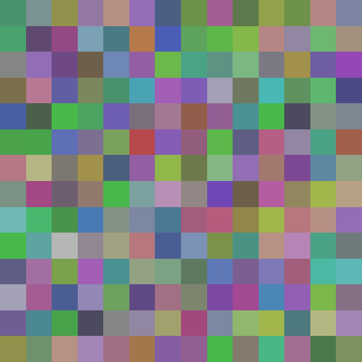
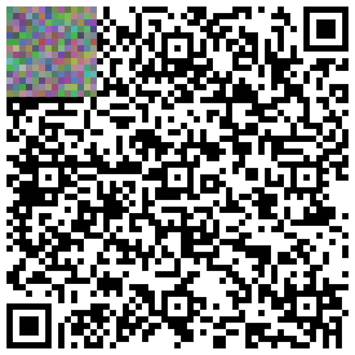
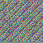

# DQR: A high-density QR code powered with deep learning

  

## About the project
A lossless, RGB, QR encoder and decoder built with convolutions 
and a custom deconvolution.

It achieves a significant density increase over traditional QR 
codes as it can be seen in the next image:

  

Both matrix barcodes encode the same amount of data (220 bytes),
but the DQR occupies less than 1/9th of the pixels that the 
traditional QR does.

## Clarifications
- Q: By relying on RGB doesn't that make it less reliable and sensible to noise?

A: Though it uses the whole RGB spectrum to encode data, 
it's actually robust to variations as it works with 
ranges of colors rather than specific color values. By training 
the network with noisy data, you can guarantee a certain noise
tolerance.

- Q: How is it lossless? If neural networks always have errors

A: Yes, neural networks have errors, however, by minimizing the 
L1 loss (MAE) between the decoded and the target tensors until 
it reaches errors of less than 1e-3, you can have a very high 
certainty that when the decoded tensor is converted to 1s and 0s,
there's no resulting error. 

This can be verified by testing the model, which
measures exact match between the decoded and target binary strings.
You should obtain an accuracy of 100% over a significant test 
set.

## Usage
Install requirements with `pip install -r requirements.txt`.

Train with `python train.py`, this will save an encoder and
decoder model that you can then use with `python encode.py file_path`
and `python decode.py file_path out_name`.

To use the pretrained model, remove the `.3x` from the models at
the [models](./models) folder

## TO-DOs
- [ ] Increase downscaling multiplier. Currently at 3x.
- [ ] Test/improve tolerance to noise.
- [ ] Improve determining whether the model is lossless or not.
- [ ] Train for decoding with mobile cameras.
  - [ ] Implement position, alignment and timing patterns, though the network might discover that by itself.

## For fun
This whole README is encoded in the following DQR code.

  

And decoding it yields the same text back, as expected.
